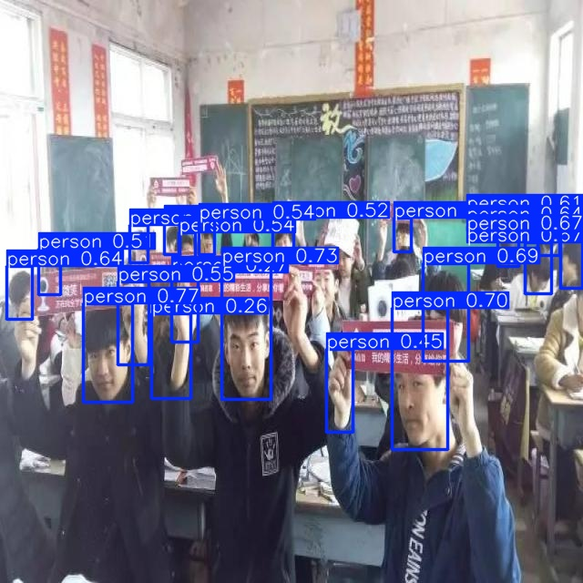

# 🧠 Head Detection with YOLOv8 + Streamlit

This project provides a simple and interactive **Streamlit web application** that allows users to **upload an image** and detect human heads using the **YOLOv8 object detection model**.

---

## 🚀 Features

- 📤 Upload `.jpg`, `.jpeg`, or `.png` images (up to 200MB)
- ⚡ Fast and accurate **head detection** using YOLOv8
- 🖼️ Real-time visualization of detected heads
- 🧩 Minimal and responsive UI using **Streamlit**

---

## 📸 Demo

| Uploaded Image | Detected Heads |
|----------------|----------------|
|  |  |

---

## 🛠️ Tech Stack

- **Frontend**: [Streamlit](https://streamlit.io/)
- **Model**: [YOLOv8 (Ultralytics)](https://github.com/ultralytics/ultralytics)
- **Language**: Python 3.x

---

## 📦 Installation

### 1. Clone the Repository

```bash
git clone git@github.com:your-username/Head-Detection-Using-YOLO.git
cd Head-Detection-Using-YOLO
```

### 2. Create and Activate a Virtual Environment

```bash
python -m venv venv
# Activate (choose your OS):
source venv/bin/activate      # macOS/Linux
venv\Scripts\activate       # Windows
```

### 3. Install Dependencies

```bash
pip install -r requirements.txt
```

### 4. Run the Streamlit App

```bash
streamlit run app.py
```

---

## 🗂️ Project Structure

```
Head-Detection-Using-YOLO/
├── app.py                   # Streamlit app script
├── frontend/
│   └── static/              # Input and output image samples
├── requirements.txt         # Required Python packages
├── weights/                 # YOLOv8 trained model (optional)
└── README.md                # Project documentation
```

---

## ✅ To Do / Future Improvements

- [ ] Support webcam/video input
- [ ] Integrate line-crossing for head counting
- [ ] Add real-time FPS overlay
- [ ] Dockerize the app for easy deployment

---

## 🔒 License

This project is licensed under the MIT License.

---

## 👤 Author

- [Rahul Agarwal](https://github.com/your-username)

---

## 🙌 Acknowledgements

- [Ultralytics YOLOv8](https://github.com/ultralytics/ultralytics)
- [Streamlit](https://streamlit.io/)
